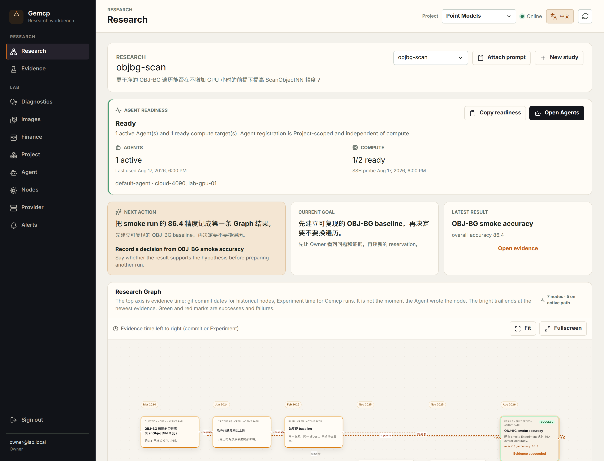
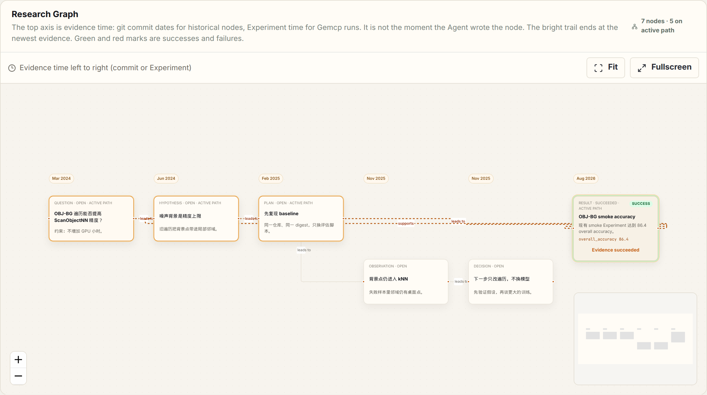

# Gemcp

[English](README.md) · [中文](README.zh.md)

**A private research workbench.** You see a Study, a plan, and a research Graph. Connected coding agents propose the next experiment. You confirm before anything spends. Gemcp then schedules the work, reserves budget, and writes the result back as evidence.

Provider tokens, node credentials, and audit stay in a separate **Lab** layer. Agents never receive those secrets.

> **This README is for people.**
> Coding agents working in this repository: [AGENTS.md](AGENTS.md).
> Agents connected to a running Gemcp over MCP: [guides/agent-mcp.md](guides/agent-mcp.md) (or call `get_usage_guide`).

Current release: **v0.20.0** ([`VERSION`](VERSION), [notes](docs/releases.md)). Use `main`.

<p align="center">
  
</p>
<p align="center"><em>Research is the home view. Lab (budget, Provider, nodes, alerts) stays one click away.</em></p>

<p align="center">
  
</p>
<p align="center"><em>The Graph is a scientific lineage, not a git commit graph. A paid run starts from a connected hypothesis.</em></p>

## What you get

- **Owner-first console** — start from the research question, not from GPU inventory.
- **Human-confirmed spend** — an agent can only *prepare* a run. You approve the exact digest before budget is reserved.
- **MCP in the research repo** — Cursor, Claude Code, Codex, OpenCode, Grok, and Pi. Enable Gemcp in that directory, not as a global server.
- **Four compute backends** — local CPU (no NVIDIA), Cloud SSH, Self-hosted Docker GPUs, or AutoDL. They do not silently fall back to one another.
- **One vocabulary** — Study, hypothesis, run, result. The same words appear in the console, MCP, and [Graph contract](docs/graph-contract.md).

## Quick start (laptop, no GPU)

You need a Go 1.21+ command (the `go.mod` pin is 1.26.6 and will download that toolchain), Node.js 22+, and PostgreSQL 16+ on `127.0.0.1:5432`. Debian/Ubuntu apt Go and PostgreSQL are enough to bootstrap.

```bash
./scripts/bootstrap-local.sh
./scripts/dev-serve.sh
```

Open [http://127.0.0.1:8080](http://127.0.0.1:8080). The first visit is setup (Owner → Compute → Project). Skip AutoDL. Copy the Agent Token once — Gemcp will not show it again. Owner email/password come from `.env` (`GEMCP_DEV_OWNER_*`).

That script writes repo-root `.env` from `deploy/env.local.example`, generates `GEMCP_MASTER_KEY` and `GEMCP_BOOTSTRAP_TOKEN`, creates the `gemcp` role/database, and builds `./bin/gemcp`. Do **not** copy `.env.example` for this path (that file is the production Compose template).

In a second terminal, optional checks:

```bash
./scripts/local-http-smoke.sh   # health, setup, MCP initialize
./scripts/local-cpu-loop.sh     # five-step CPU experiment, no NVIDIA
```

The console language toggle is on the top bar (Chinese / English).

## Connect an agent

1. Sign in and open **Lab → Agent**.
2. Create a short-lived **MCP setup link** (Handshake prompt if you also want Cloud SSH). Send it only to the intended agent, in the research repository directory.
3. Let the agent enroll itself. Do not paste a long-lived Token into chat.
4. Before any paid run, the agent must show you the proposal (repo, commit, command, resource, worst-case CNY, confirmation digest). Approve that exact digest — in Evidence, or by telling the agent to submit it.

Cursor project config (`.cursor/mcp.json`), after you have a Token in the environment:

```json
{
  "mcpServers": {
    "gemcp-project": {
      "type": "http",
      "url": "http://127.0.0.1:8080/mcp",
      "headers": {
        "Authorization": "Bearer ${env:GEMCP_AGENT_TOKEN}"
      }
    }
  }
}
```

Production uses `https://<gemcp-host>/mcp`. Client-by-client snippets: [Owner MCP guide](guides/owner-mcp.md). Full tool list: [MCP clients](docs/mcp.md).

A `submit` scope is technical capability, not a blank check. Every prepared proposal still needs your confirmation of that digest.

## How a paid run starts

```text
You record a hypothesis on the Graph
        │
Agent prepares a zero-cost proposal  (prepare_experiment)
        │
You confirm the exact digest
        │
Agent submits once                   (submit_prepared_experiment)
        │
Gemcp writes the run, then the result (close_run)
```

Recording a Graph node never starts a machine. `submit_experiment` is an Advanced compatibility path and is rejected while a Study is active.

## Where work runs

| Backend | Typical use | GPU |
| --- | --- | --- |
| Local process | Laptop smoke / CPU fixture | No |
| Cloud SSH (experimental) | argv as a host process on a registered Linux box | Optional |
| Self-hosted node | `gemcp-node` + Docker on a machine you own | NVIDIA |
| AutoDL Private Cloud / Public Elastic | Official Job APIs | Yes |

Paid AutoDL needs a reachable HTTPS `GEMCP_PUBLIC_URL` and the scheduler on. Cloud SSH stays off until `GEMCP_SSH_CLOUD_ENABLED=true`. Details: [Self-hosted](docs/self-hosted-nodes.md), [Cloud SSH](docs/ssh-cloud-nodes.md), [Provider](docs/provider-operations.md).

```text
You  --HTTPS Web-->  Gemcp  --MCP-->  coding agent
                       |
                       +--> PostgreSQL
                       +--> local CPU / SSH host / gemcp-node / AutoDL
```

The Vue console is embedded in the Go binary. Redis, Kubernetes, and a separate frontend runtime are not required.

## Documentation

| If you want to… | Read |
| --- | --- |
| Use the product (this page) | [README.md](README.md) · [README.zh.md](README.zh.md) |
| Connect Cursor / Claude / Codex / … | [guides/owner-mcp.md](guides/owner-mcp.md) |
| Operate Gemcp *as* an MCP agent | [guides/agent-mcp.md](guides/agent-mcp.md) |
| Work on this repository | [AGENTS.md](AGENTS.md) |
| Understand Study / hypothesis / run / result | [docs/graph-contract.md](docs/graph-contract.md) |
| See how the control plane is put together | [docs/architecture.md](docs/architecture.md) · [interactive map](docs/framework-map.html) |
| Walk through the console | [docs/web-console.md](docs/web-console.md) · [docs/research-workbench.md](docs/research-workbench.md) |
| Test a checkout | [docs/tester-brief.md](docs/tester-brief.md) |
| Deploy with Compose | [deploy/README.md](deploy/README.md) |
| See what shipped | [docs/releases.md](docs/releases.md) · [docs/roadmap.md](docs/roadmap.md) |

Hosted copies of the Owner and Agent guides are `/docs/owner-mcp.md` and `/docs/agent-mcp.md` on a running control plane. Deeper topics: [setup API](docs/setup-api.md), [Agent Tokens](docs/agent-tokens.md), [architecture](docs/architecture.md), [interactive map](docs/framework-map.html), [execution](docs/execution.md), [finance](docs/finance.md), [diagnostics](docs/diagnostics.md), [notifications](docs/notifications.md).

## Production deploy

```bash
./bin/gemcp keygen
./bin/gemcp bootstrap-token
cp .env.example deploy/.env
# write the generated credentials, keep GEMCP_ENV=production
cd deploy
docker compose up -d --build
```

Bind the origin to localhost and publish it through the configured Cloudflare Tunnel. Do not expose port 8080 to the public Internet. Existing Compose deployments must follow the [PostgreSQL 18 volume upgrade](deploy/README.md#postgresql-18-volume-upgrade) before recreating the database container.

Full checklist: [deploy/README.md](deploy/README.md).

## Develop

```bash
npm --prefix frontend install
make test
make frontend-test
make build
```

Browser tests, once per machine:

```bash
npx --prefix frontend playwright install chromium
make frontend-e2e
```

## Security

No real AutoDL, SMTP, Git, Runner, Agent setup, Node setup, or experiment secret belongs in this repository. Provider, SMTP, and Git private credentials are encrypted at rest. Agent and Node setup codes and their long-lived Tokens are stored only as HMAC digests. AutoDL Runner Tokens are Attempt-scoped and never passed to the user command environment. Self-hosted workload containers receive no Gemcp credential.
