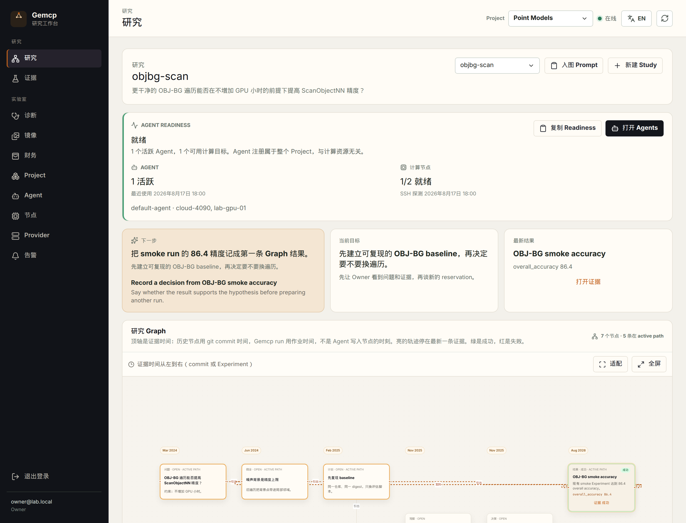

# Gemcp

[English](README.md) · [中文](README.zh.md)

**私有研究工作台。** 你看到的是 Study、计划和一张研究 Graph。连上来的编码 Agent 提出下一步实验；花钱之前必须由你确认。Gemcp 负责调度、预留预算，再把结果写回成证据。

Provider Token、节点凭据和审计留在单独的 **Lab** 层。Agent 拿不到这些秘密。

> **这份 README 给人读。**
> 在本仓库里改代码的 Agent：看 [AGENTS.md](AGENTS.md)。
> 已经通过 MCP 连上运行中 Gemcp 的 Agent：看 [guides/agent-mcp.md](guides/agent-mcp.md)（或调用 `get_usage_guide`）。

当前版本：**v0.20.0**（[`VERSION`](VERSION)，[更新说明](docs/releases.md)）。请用 `main`。

<p align="center">
  
</p>
<p align="center"><em>首页是研究视图。预算、Provider、节点、告警都在 Lab，点一下就能到。</em></p>

<p align="center">
  
</p>
<p align="center"><em>Graph 是科学谱系，不是 git commit 图。付费运行必须从一条连得上的 hypothesis 出发。</em></p>

## 你能用来做什么

- **先看科学问题** — 控制台从 Study 和 Graph 开始，而不是从 GPU 库存开始。
- **人确认后再花钱** — Agent 只能 *准备* 一次运行。你确认精确 digest 之后，才会预留预算。
- **在研究仓库里开 MCP** — 支持 Cursor、Claude Code、Codex、OpenCode、Grok、Pi。在那个目录启用 Gemcp，不要开成全局 MCP。
- **四条算力路径** — 本地 CPU（不需要 NVIDIA）、Cloud SSH、自建 Docker GPU、或 AutoDL。它们不会悄悄互相 fallback。
- **一套用词** — Study、hypothesis、run、result。控制台、MCP 和 [Graph 契约](docs/graph-contract.md) 用同一套词。

## 五分钟本地跑起来（笔记本，不用 GPU）

需要：Go 1.21+（`go.mod` 钉的是 1.26.6，会自动拉官方工具链）、Node.js 22+、本机 `127.0.0.1:5432` 上的 PostgreSQL 16+。Debian/Ubuntu 源里的 Go 和 PostgreSQL 够用来引导。

```bash
./scripts/bootstrap-local.sh
./scripts/dev-serve.sh
```

打开 [http://127.0.0.1:8080](http://127.0.0.1:8080)。第一次访问是初始化（Owner → Compute → Project）。AutoDL 选跳过。把一次性 Agent Token 复制下来，之后不会再显示。Owner 邮箱/密码在 `.env` 的 `GEMCP_DEV_OWNER_*`。

脚本会从 `deploy/env.local.example` 写出仓库根目录的 `.env`，生成 `GEMCP_MASTER_KEY` 和 `GEMCP_BOOTSTRAP_TOKEN`，创建 `gemcp` 角色和数据库，并编译 `./bin/gemcp`。这条路径 **不要** 去抄 `.env.example`（那是生产 Compose 模板）。

第二个终端可以跑自检：

```bash
./scripts/local-http-smoke.sh   # 健康检查、初始化、MCP initialize
./scripts/local-cpu-loop.sh     # 五步 CPU 实验，不需要 NVIDIA
```

顶栏可以切换中文 / English。

## 接上一个 Agent

1. 登录后打开 **Lab → Agent**。
2. 创建一次性 **MCP setup link**（如果还要 Cloud SSH，用 Handshake prompt）。只发给目标 Agent，并且让它在研究仓库目录里启用。
3. 让 Agent 自己完成注册。不要把长期 Token 贴进聊天。
4. 任何付费运行之前，Agent 必须把提案亮给你看（仓库、commit、命令、资源、最坏情况人民币、confirmation digest）。你确认这个精确 digest —— 在 Evidence 里确认，或明确授权 Agent 提交它。

有 Token 之后，Cursor 项目配置（`.cursor/mcp.json`）：

```json
{
  "mcpServers": {
    "gemcp-project": {
      "type": "http",
      "url": "http://127.0.0.1:8080/mcp",
      "headers": {
        "Authorization": "Bearer ${env:GEMCP_AGENT_TOKEN}"
      }
    }
  }
}
```

生产环境用 `https://<gemcp-host>/mcp`。各客户端完整片段：[Owner MCP 指南](guides/owner-mcp.md)。工具列表：[MCP 客户端](docs/mcp.md)。

`submit` 权限只是技术能力，不是空白支票。每条准备好的提案，仍然要你确认那条 digest。

## 一次付费运行怎么走

```text
你在 Graph 上记下一条 hypothesis
        │
Agent 零成本准备提案          (prepare_experiment)
        │
你确认精确 digest
        │
Agent 提交一次                (submit_prepared_experiment)
        │
Gemcp 写入 run，再用 close_run 写回 result
```

在 Graph 上记一个节点 **不会** 启动机器。`submit_experiment` 是旧的 Advanced 兼容路径，有活跃 Study 时会被拒绝。

## 活跑在哪

| 后端 | 典型用途 | GPU |
| --- | --- | --- |
| 本地进程 | 笔记本冒烟 / CPU 夹具 | 不需要 |
| Cloud SSH（实验性） | 在已登记的 Linux 机器上直接跑 argv | 可选 |
| 自建节点 | 你自己的机器上 `gemcp-node` + Docker | NVIDIA |
| AutoDL 私有云 / 公有弹性 | 官方 Job API | 需要 |

付费 AutoDL 需要能从外网访问的 HTTPS `GEMCP_PUBLIC_URL`，并且打开调度器。Cloud SSH 要到 `GEMCP_SSH_CLOUD_ENABLED=true` 才会启用。细节：[自建节点](docs/self-hosted-nodes.md)、[Cloud SSH](docs/ssh-cloud-nodes.md)、[Provider](docs/provider-operations.md)。

```text
你  --HTTPS Web-->  Gemcp  --MCP-->  编码 Agent
                      |
                      +--> PostgreSQL
                      +--> 本地 CPU / SSH 主机 / gemcp-node / AutoDL
```

Vue 控制台嵌在 Go 发布二进制里。不需要 Redis、Kubernetes，也不需要单独跑前端。

## 文档怎么找

| 你想… | 看这里 |
| --- | --- |
| 当人来用产品（本页） | [README.md](README.md) · [README.zh.md](README.zh.md) |
| 给 Cursor / Claude / Codex 接线 | [guides/owner-mcp.md](guides/owner-mcp.md) |
| **作为** MCP Agent 操作 Gemcp | [guides/agent-mcp.md](guides/agent-mcp.md) |
| 在本仓库里改代码 | [AGENTS.md](AGENTS.md) |
| 搞清 Study / hypothesis / run / result | [docs/graph-contract.md](docs/graph-contract.md) |
| 看控制面怎么分层 | [docs/architecture.md](docs/architecture.md) · [交互框架图](docs/framework-map.html) |
| 走一遍控制台 | [docs/web-console.md](docs/web-console.md) · [docs/research-workbench.md](docs/research-workbench.md) |
| 测一个 checkout | [docs/tester-brief.md](docs/tester-brief.md) |
| Compose 部署 | [deploy/README.md](deploy/README.md) |
| 看发了什么 | [docs/releases.md](docs/releases.md) · [docs/roadmap.md](docs/roadmap.md) |

运行中的控制平面也会在 `/docs/owner-mcp.md` 和 `/docs/agent-mcp.md` 提供 Owner / Agent 指南。再往下：[setup API](docs/setup-api.md)、[Agent Token](docs/agent-tokens.md)、[架构](docs/architecture.md)、[交互框架图](docs/framework-map.html)、[执行](docs/execution.md)、[财务](docs/finance.md)、[诊断](docs/diagnostics.md)、[通知](docs/notifications.md)。

## 生产部署

```bash
./bin/gemcp keygen
./bin/gemcp bootstrap-token
cp .env.example deploy/.env
# 填入刚生成的凭据，保持 GEMCP_ENV=production
cd deploy
docker compose up -d --build
```

把源站绑在 localhost，用已配置的 Cloudflare Tunnel 对外。不要把 8080 暴露到公网。已有 Compose 部署在重建数据库容器前，必须先做 [PostgreSQL 18 卷升级](deploy/README.md#postgresql-18-volume-upgrade)。

完整清单：[deploy/README.md](deploy/README.md)。

## 开发

```bash
npm --prefix frontend install
make test
make frontend-test
make build
```

浏览器测试（每台机器做一次）：

```bash
npx --prefix frontend playwright install chromium
make frontend-e2e
```

## 安全

仓库里不要放真实的 AutoDL、SMTP、Git、Runner、Agent setup、Node setup 或实验密钥。Provider、SMTP 和 Git 私钥静态加密。Agent / Node 的 setup code 和长期 Token 只存 HMAC 摘要。AutoDL Runner Token 按 Attempt 作用域发放，不会进用户命令环境。自建作业容器拿不到任何 Gemcp 凭据。
