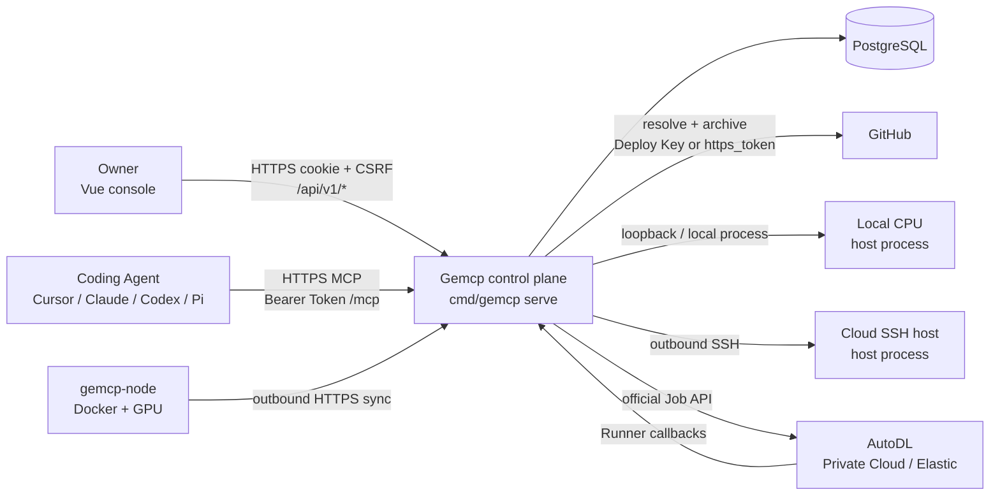
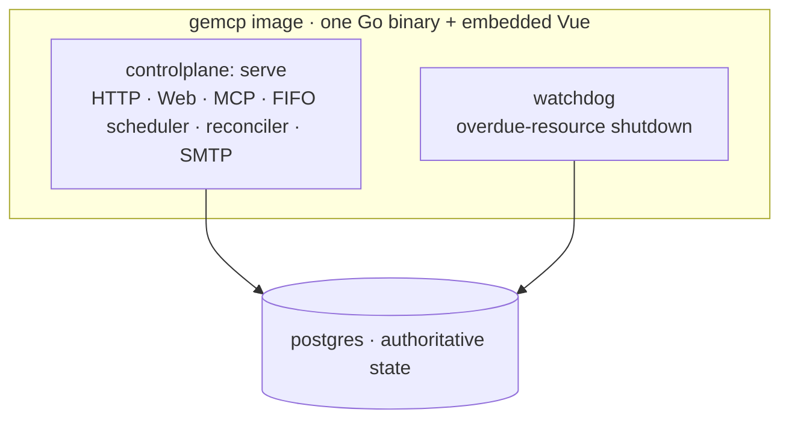
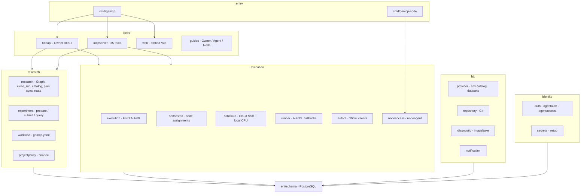
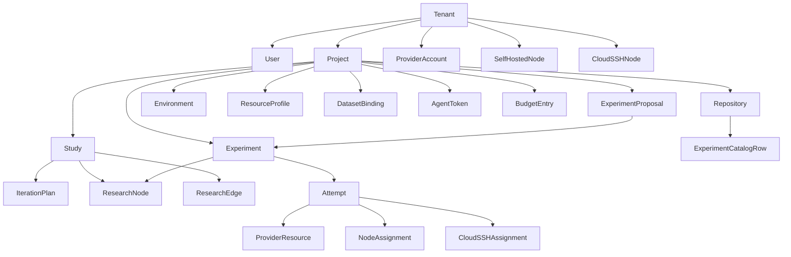
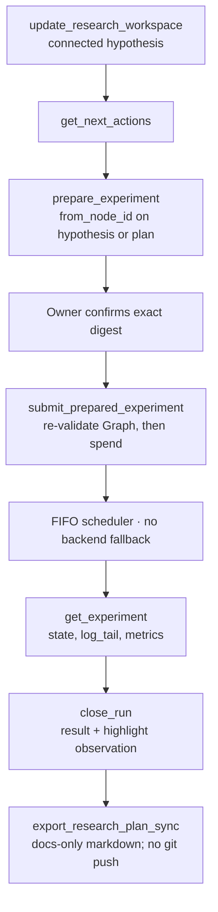

# Architecture

Status: current as of **v0.20.0**. Shared words stay in [Hypothesis–experiment Graph contract](graph-contract.md). An interactive companion (roles, Graph, paid loop, package map) is [framework-map.html](framework-map.html) — open the file in a browser; the control plane does not serve it.

## Maps

### System context

Everyone talks only to Gemcp. Agents never receive host keys, Provider tokens, or node credentials. Recording a Graph node never starts a workload.



### Runtime processes

Production Compose runs one image twice, plus PostgreSQL. `gemcp-node` is optional and lives on machines the lab owns.



| Process | Binary / command | Owns |
| --- | --- | --- |
| controlplane | `gemcp serve` | Owner Web, `/mcp`, enrollments, Runner callbacks, Node sync, opt-in FIFO dispatch |
| watchdog | `gemcp watchdog` | Independent stop/delete of owned resources when HTTP is stuck |
| postgres | PostgreSQL 16+ local / 18 in Compose | Identity, Graph, proposals, experiments, reservations, leases, audit |
| gemcp-node | `gemcp-node run` | Outbound HTTPS, one-GPU Docker Attempt, local deadline |

The FIFO scheduler is off until `GEMCP_SCHEDULER_ENABLED=true`. Loopback HTTP can arm Cloud SSH / local CPU dispatch. AutoDL create still needs a credential-free HTTPS `GEMCP_PUBLIC_URL` for Runner callbacks. Each long-running role writes its own PostgreSQL heartbeat.

### Control-plane packages

`internal/server` only wires Gin. Domain rules live in the packages below; MCP and Owner HTTP call the same services.



| Path | Responsibility |
| --- | --- |
| `cmd/gemcp` | `serve`, `watchdog`, `phase0`, `keygen`, `bootstrap-token` |
| `cmd/gemcp-node` | `enroll`, `run`, `doctor` |
| `internal/server` | Gin routes, CSP, readiness |
| `internal/httpapi` | Owner `/api/v1` handlers |
| `internal/mcpserver` | Streamable HTTP MCP, 35 tools, `gemcp://docs/agent-guide` |
| `internal/web` + `frontend/` | Embedded Owner console |
| `internal/research` | Study, Graph legality, `close_run`, catalog, plan sync, route |
| `internal/experiment` | Proposal prepare/submit, views, artifacts, activity |
| `internal/workload` | Named `gemcp.yaml` / saved Project workloads |
| `internal/execution` | FIFO scheduler, AutoDL ownership, reconcile, finalize |
| `internal/selfhosted` | Node Assignment commands and event projection |
| `internal/sshcloud` | Outbound SSH host process; loopback local CPU |
| `internal/runner` | Attempt-scoped bootstrap, spec, source, events |
| `internal/autodl` | Private Cloud / Public Elastic / Pro clients |
| `internal/nodeaccess` | Node enrollment, pairing, `/nodes/sync` |
| `internal/nodeagent` | Daemon: Docker isolation, GPU lock, local logs |
| `internal/watchdog` | Monotonic stop/delete of owned resources |
| `internal/finance` | Budget periods, reservations, settlement |
| `internal/repository` | GitHub register/verify, Deploy Key or write-only `https_token` |
| `internal/environmentcatalog` | Project Environments (AutoDL image or `host/cpu/local`) |
| `internal/datasetcatalog` | Dataset bindings and allowlisted provision sources |
| `internal/workspacecatalog` | Paths under Owner-approved trusted workspace roots |
| `internal/provider` | Credential-safe AutoDL inventory views |
| `internal/diagnostic` | Owner-confirmed fixed-suite Experiments |
| `internal/imagebake` | Zero-cost Pro bake request; provider is fail-closed |
| `internal/auth` / `agentauth` / `agentaccess` | Owner session; MCP Bearer; setup-link enrollment |
| `internal/secrets` / `setup` | Master-key box; first-run transaction |
| `internal/notification` | Encrypted SMTP + durable outbox |
| `ent/schema` | Durable model |

### Durable model

A tenant-aware schema with one Owner in the first release. Caps: 32 Studies per Project; 128 nodes and 256 edges per Study.



Study **route** fields (`protocol_branch`, `protocol_doc_path`, `code_ref_pattern`) bind docs-only protocol refs separately from live experiment refs. Catalog rows hang off the repository, not the 128-node Graph.

### Owner console

`frontend/src/App.vue` picks setup / login / console from server state. `ConsoleView` is the shell.

```text
Research
  ├── Research     Study, next actions, Graph, plan sync
  └── Evidence     Experiments, digest confirmation, close_run

Lab
  ├── Diagnostics  fixed-suite Owner Experiments
  ├── Images       AutoDL Pro bake workspace (fail-closed create)
  ├── Finance      budget and reservations
  ├── Project      policy, repo, environments, datasets
  ├── Agent        setup links and Tokens
  ├── Nodes        Self-hosted + Cloud SSH (when enabled)
  ├── Provider     AutoDL views and rotation
  └── Alerts       SMTP and notification history
```

### Paid path

Money is committed only to a bindable run. Isolated nodes and plans that hang only off the question cannot prepare.



`submit_experiment` is an Advanced compatibility path and is rejected while a Study is active.

### HTTP and MCP surfaces

```text
Public / unauthenticated
  GET  /healthz  /readyz  /api/v1/version
  GET  /docs/owner-mcp.md  /docs/agent-mcp.md
  GET  /agent/setup  /node/setup
  POST /api/v1/setup  /api/v1/auth/login
  POST /api/v1/agent-enrollments/{claim,complete}
  POST /api/v1/node-enrollments/claim
  POST /api/v1/nodes/sync
  GET  /api/v1/node-assignments/:id/source
  GET|POST /api/v1/runner/{bootstrap,spec,source,events}
  ANY  /mcp

Owner session + CSRF
  /api/v1/projects/:id/research          Graph, close_run, plan-sync
  /api/v1/projects/:id/experiment-proposals
  /api/v1/experiments                    evidence and artifacts
  Lab: finance, provider, runtime, nodes, ssh-cloud-nodes,
       agent-tokens, diagnostics, image-bakes, notifications,
       repositories, environments, dataset-bindings
```

MCP registers **35** tools. The happy-path names are the Graph-contract verbs: `get_research_workspace`, `get_next_actions`, `update_research_workspace`, `prepare_experiment`, `submit_prepared_experiment`, `get_experiment`, `close_run`, `export_research_plan_sync`.

## Boundaries

Gemcp is a private single-organization service. The initial data model remains tenant-aware, but the first release has one owner and up to two AutoDL provider accounts: Private Cloud and Public Elastic.

The control plane owns:

- A research Graph and iteration plan that the Owner reviews first.
- Isolated Docker sub-agents on authorized machines.
- Human configuration and audit through a separate Lab layer.
- Owner-confirmed, fixed-suite backend diagnostics through the normal Experiment lifecycle.
- Agent authentication, zero-cost prepared proposals, confirmed submission, and Advanced experiment operations through MCP.
- Project policy, budget reservation, and cost estimates.
- Provider reconciliation and resource ownership.
- Independent timeout and shutdown enforcement.

AutoDL owns physical scheduling, container execution, provider billing, images, and shared file storage.

## Runtime topology

The production image contains one Go binary and the embedded Vue assets. The Web application selects first-run setup, Owner login, or the operations console from server state; it does not require a separate frontend runtime. The same image supports separate process modes:

```text
controlplane: HTTP API, Web, MCP, scheduler, reconciler, email
watchdog:     independent overdue-resource shutdown loop
postgres:     authoritative durable state
```

The FIFO scheduler runs in the controlplane process only when explicitly enabled. Loopback HTTP is an acceptable public origin for starting the scheduler so local Cloud SSH dispatch can run; AutoDL create still requires a credential-free HTTPS origin for Runner callbacks. The watchdog remains a separate process so a stuck or unavailable HTTP path cannot disable shutdown enforcement. Each long-running role writes an independently visible PostgreSQL heartbeat.

Owner-facing compute has four paths. They do not silently fall back to one another:

| Path | How it runs | Notes |
| --- | --- | --- |
| Local process | Host process on loopback | `GEMCP_LOCAL_PROCESS_ENABLED`; development default. Uses the Cloud SSH host-process machinery, not a fifth scheduler. |
| Cloud SSH | Control plane outbound SSH, argv as a host process | Experimental; `GEMCP_SSH_CLOUD_ENABLED`. No image lock, no Docker, no Git archive. |
| Self-hosted | `gemcp-node` dials outbound HTTPS; Docker + one GPU | Feature-gated. Node Token never enters the container. |
| AutoDL | Official Private Cloud or Public Elastic Job APIs | Paid path. Public Pro is not a scheduling fallback. |

Selecting the wrong backend fails. Cloud SSH details are in [Cloud SSH nodes](ssh-cloud-nodes.md). Self-hosted details are in [Self-hosted nodes](self-hosted-nodes.md).

## Durable coordination

PostgreSQL is authoritative for identity, configuration, expiring Experiment Proposals, experiments, attempts, reservations, provider resources, idempotency records, audit events, and leases. In-memory queues may wake workers but never own job state.

A submitted Experiment is immutable. The normal Agent path resolves a ref and compatible defaults into an expiring, zero-cost Proposal. Its digest binds Project policy, repository identity, full commit, structured argv, Environment, Resource Profile, runtime, and reservation. Confirmed submission rechecks drift and budget in a serializable transaction; the Proposal itself ensures that one confirmation creates at most one Experiment. The Advanced direct path retains Token-scoped caller idempotency and shell-command compatibility. Owner diagnostics create the same immutable Experiment without fabricating Agent Token attribution; a linked `DiagnosticRun` stores only hashed idempotency material, the fixed suite, Owner identity, and the confirmed preflight snapshot. Infrastructure retries create Attempts under the same Experiment. A manual rerun creates a new Experiment.

The remote MCP endpoint uses the official Go SDK's Streamable HTTP transport. Agent Bearer Tokens are checked against PostgreSQL for each request, and MCP sessions are bound to the authenticated Token identity. Owner-only APIs issue project credentials with bounded scopes and optional expiry, return plaintext once, and generate the canonical MCP URL only from `GEMCP_PUBLIC_URL`.

## Provider boundary

The production AutoDL adapter uses documented Developer APIs; browser automation is excluded. Production scheduling supports **AutoDL Private Cloud Job** (`autodl_private`) and **AutoDL Public Elastic Job** (`autodl_elastic`). Public Pro is not a production Experiment scheduling fallback. Lab image bake can request a Pro image through Owner-confirmed digest; the shipped bake provider is fail-closed until a live Pro client is wired.

The two production AutoDL backends have separate contracts. Private Cloud uses `https://private.autodl.com`, has no Developer wallet endpoint, exposes non-regional GPU inventory, and uses one `cuda_v` selector. Public Elastic uses `https://api.autodl.com`, requires an enterprise-verified account for Elastic deployment APIs, queries GPU inventory one region at a time, and creates deployments with `container_template.dc_list` plus a CUDA range. A Public Elastic stock count represents individual idle GPUs and does not prove that multiple cards are available in one machine.

The Provider adapter decrypts the credential only inside the controlplane or Watchdog process. Owner APIs expose normalized GPU, image, deployment, container, cache, and event views. Token rotation validates the candidate against the required read endpoints for its official host before an atomic encrypted update and audit event. Public container inventory is queried per deployment because the documented API requires `deployment_uuid`. Container access fields, including root passwords, SSH commands, and public service URLs, are intentionally absent from the decoded model.

Image discovery is also backend-specific. Both backends expose user-private images through the Developer API. Private Cloud additionally attempts its optional Web-console system-image endpoint. Public Elastic has no dynamic system-image list endpoint in the Developer API, so approved public base-image UUIDs come from current AutoDL documentation or the console and may not appear in Provider discovery.

Execution records every Provider request ID available in responses. The validated Private Cloud installation did not return request IDs, and callers cannot assume Public Elastic always returns one, so deterministic resource names, persisted ownership before create, immutable local Attempt IDs, and reconciliation queries remain mandatory. An Attempt makes at most one create request; an uncertain response is resolved by name before retrying at the experiment level. Truncated listings cannot prove absence.

Stop intent is durable and monotonic. Agent cancel, Owner stop, emergency stop, deadline expiry, and budget enforcement all update owned resource rows. Scheduler and Watchdog idempotently converge those resources to stopped and deleted. Neither process adopts or mutates external resources.

## Storage boundary

M0 uses an existing path under `/root/autodl-fs`. Experiment output remains in UUID-scoped project and experiment directories there. PostgreSQL stores bounded log tails, scalar metrics, Runner result fields, and paths, not large artifacts. Cloud SSH copies those same bounded fields over Owner-held SSH before deleting the remote work directory; Agents see them only through `get_experiment`. The controlplane securely archives the exact verified private Git commit; an Attempt-scoped Runner Token retrieves it without exposing the Deploy private key to the experiment.

Stopped-container reuse is an opportunistic cache. Correctness cannot depend on a cache hit.

## Security boundary

Agent Bearer Tokens identify project-scoped principals and are stored as keyed hashes. Issuance and revocation are audited; token lists expose only prefix, scopes, status, expiry, and usage timestamps. Pi enrollment uses a short-lived fragment setup code stored only as a keyed hash; its retryable read-only Token is deterministically HMAC-derived and never stored recoverably. Verified completion atomically activates the Owner-selected scopes and lifetime. One-time MCP exports contain a live secret and are never persisted by Gemcp. AutoDL, Git Deploy Key, write-only repository `https_token`, SMTP, Cloud SSH host credentials, and transient Runner credentials are encrypted with a master key that is not stored in PostgreSQL. GitHub host keys are pinned by trusted SHA256 fingerprint before a repository can become active.

Owner Sessions use Secure, HttpOnly, SameSite=Strict cookies plus CSRF validation for state-changing requests. API and MCP responses are marked `no-store`, including first-run and Agent enrollment responses that contain credentials. Provider responses expose only a credential-presence boolean; neither plaintext Token nor ciphertext has an API representation.

Experiments may access the public Internet. Any injected Secret must therefore be project-scoped, low privilege, and readily rotatable. Gemcp does not claim to sandbox arbitrary experiment code.
